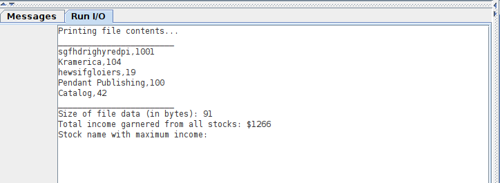
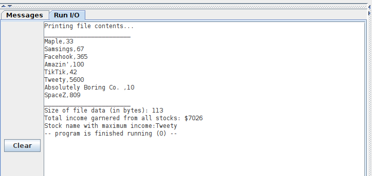

# Lab 4: Record pointer

|	|	|
|:------:	|:-----------------------------------------------:	|
| `Name` 	| Gabriela  	|
| `CruzID` 	|  	|
| `Year` 	|  	|


# Table of Contents:


- [Description](#description)
- [List of Files](#list-of-files)
- [instructions](#instructions)
- [Test Results](#test-results)
- [Acknowledgments](#acknowledgments)
- [Sponsors](#sponsors)
- [Release History](#release-history)


# Description:
- In this lab, the code reads a .csv containing number of records informing thier income return.
The program extract 
	- length of file in bytes (including linux  \n char)
	- Total income 
	- Max income

# List of Files:
- README.md: This file.
- lab4f22_testbench.asm : it is the main program to test the code
- allocate_file_record_pointers.asm : it pushes (into heap) the address of first character in record name and record income
- income_from_record.asm : this subroutine gets the income of the record as an integer value
- length_of_file.asm: it returns the file length in bytes (containing OS meta data)
- totalIncome.asm: it accumulate income data
- maxIncome.asm : it returns maximum income record
- Tests/ 
	- data.csv
	- data2.csv
	- data3.csv
- Results/ 
	- data.png
	- data2.png
	- data3.png 


# instructions:
- This program is intended to be run using the RISCV Assembler and Runtime Simulator(RARS). 
- Having the directory structure as in [List of Files](#list-of-files)  section and "file_name.csv" file that will be processed

- Open RARS simulator
- In "lab4f22_testbench.asm"  line number 60, You should include the path for .csv from your machine (eg: lab-dir/Tests/file_name.csv)
- Assemble & Run 
- into RARS terminal it will print 
	csv file content 
	length of the file 
	total income 
	max income record
# Test results
## Data.csv 
```csv
Kruger Industrial Smoothing,365
Kramerica,0
Vandelay Industries,500
Pendant Publishing,100
J. Peterman Catalog,42
```
***output***


## Data2.csv 
```csv
sgfhdrighyredpi,1001
Kramerica,104
hewsifgloiers,19
Pendant Publishing,100
Catalog,42
```
***output***


## Data3.csv 
```csv
Maple,33
Samsings,67
Facehook,365
Amazin',100
TikTik,42
Tweety,5600
Absolutely Boring Co. ,10
SpaceZ,809
```
***output***

