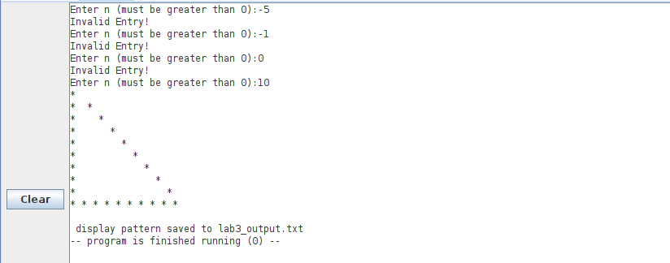
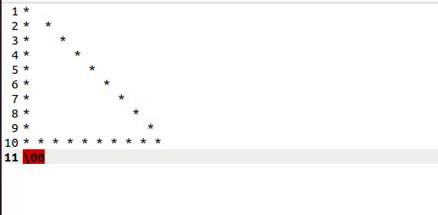

# Lab 3: Triangle

|	|	|
|:------:	|:-----------------------------------------------:	|
| `Name` 	|   	|
| `CruzID` 	|  	|
| `Year` 	|  	|

# Table of Contents:

- [Description](#description)
- [List of Files](#list-of-files)
- [instructions](#instructions)
- [Test Results](#test-results)

# Description:
- In this lab, the code reads user input representing number of lines for astrix triangle.

# List of Files:
- README.md: This file.
- triangle.asm : it is the main program to test the code

- Results/ 
	- rars.png
	- file.png

# instructions:
- This program is intended to be run using the RISCV Assembler and Runtime Simulator(RARS). 

- Open RARS simulator
- Assemble & Run .. (triangle.asm)
- into RARS terminal it will
	Ask to enter a number of rows ( greater than 0)
	print out the triangle 
- a `lab3_output.txt` is generated containing the generated astrix pattern 
# Test results

***RARS terminal***
-------

***generated output file***
-------

